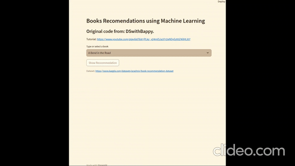

# Intro

A recommendation system is a type of machine learning model that assists people in selecting new products by leveraging their history of registered preferences. There are three main types of recommendation models: Collaborative Filtering, Content-Based Filtering, and Hybrid Methods.

In that project was utilized collaborative filtering, where users with similar tastes were grouped together using clustering algorithms.

If you're interested in learning more about this project, you can visit [DSwithBappy's YouTube channel](https://www.youtube.com/playlist?list=PLkz_y24mlSJa37r2xNDyEgt0Z4ilHtJ07).
 

